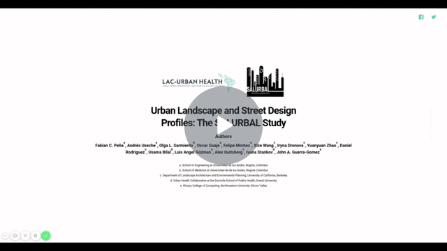

# Urban Landscape and Street Design Profiles: The SALURBAL Study

Salud Urbana en América Latina ([SALURBAL](https://drexel.edu/lac/salurbal/overview/)), is a five-year project launched in April 2017. The Drexel University Dornsife School of Public Health and partners throughout Latin America and in the United States are working together to study how urban environments and urban policies impact the health of city residents throughout Latin America.

More specifically, it is addressed in this sudy: **How to quantify the contributions of city-level Built Environment (BE) factors to differences in levels of health and health inequalities within and between cities?**

The BE significantly affects the public’s health. For more than a decade there has been an increase in the collaborations among public health, social sciences and urban planning researchers to study how the BE may impact health and health inequities. Several features of Latin American cities (LAC) make them uniquely suited for the study of their urban environment. One approach to managing the complexity and volume of the data describing the urban settings and environmental characteristics of LAC is to develop BE profiles for cities and sub-cities. These profiles are helpful because they help to understand how multiple dimensions of the BE come together in like cities.
 
## Proposed Solution

  <a href="https://fabiancpl.github.io/salurbal/">Demo</a>

## Authors

[Fabian C. Peña](https://fabiancpl.github.io) - School of Engineering
 
Andres F. Useche - School of Engineering
 
Olga L. Sarmiento - School of Medicine
 
[John A. Guerra](http://johnguerra.co/) - School of Engineering
 
Universidad de los Andes - Bogota, Colombia
